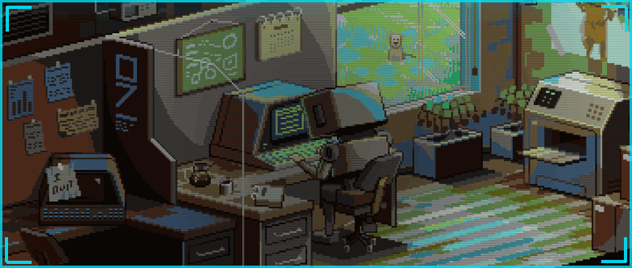
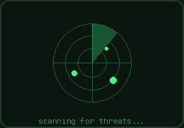
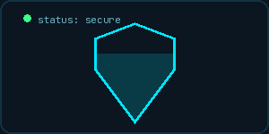

<h2 align="center">Hey there! I'm Smijal Mathew Thomas 🛡️</h2>

- 🛡️ I'm a **Cybersecurity Analyst**.
- 🕵️ Skilled in SOC operations, SIEM triage, and cloud security.
- 🔍 Enjoy writing detections and hunting threats in Azure & on-prem environments.
- 🏆 Passionate about CTFs — most recently placed 1st at Hack the Planet CTF, SAIT.

<h3 align="left">💻 Goals for the future:</h3>
<ul>
  <li>Pass CompTIA Security+ 📝</li>
  <li>Grow CYBERSEC PRO into a full open-source MDR platform 🛠️</li>
  <li>Go deeper on detection engineering and threat hunting 🕵️</li>
  <li>Contribute to open-source security tooling 🌐</li>
</ul>

<h3 align="left">🌐 Connect with me:</h3>

  
  

  

<h3 align="left">🚀 Languages and Tools:</h3>

  
  
  
  
  
  
  
  
  
  

  
  
  
  
  
  
  

<h3>🧑🏻‍💻 Currently Focused On:</h3>

<table>
  <tr>
    <td>
      
    </td>
    <td>
      Building out <b>CYBERSEC PRO</b>, a containerized network vulnerability & MDR platform (Django + Go + Docker + Snort), and expanding my <b>Azure Cloud Security Posture Scanner</b> with more CIS/NIST compliance mappings. Also finishing my Post Diploma in Data Analytics at SAIT and studying for the CompTIA Security+ exam, scheduled July 24, 2026.
    </td>
  </tr>
</table>

<h3 align="left">🏆 Recent Win:</h3>

🥇 <b>1st Place</b> — Hack the Planet CTF (SAIT), March 2026

